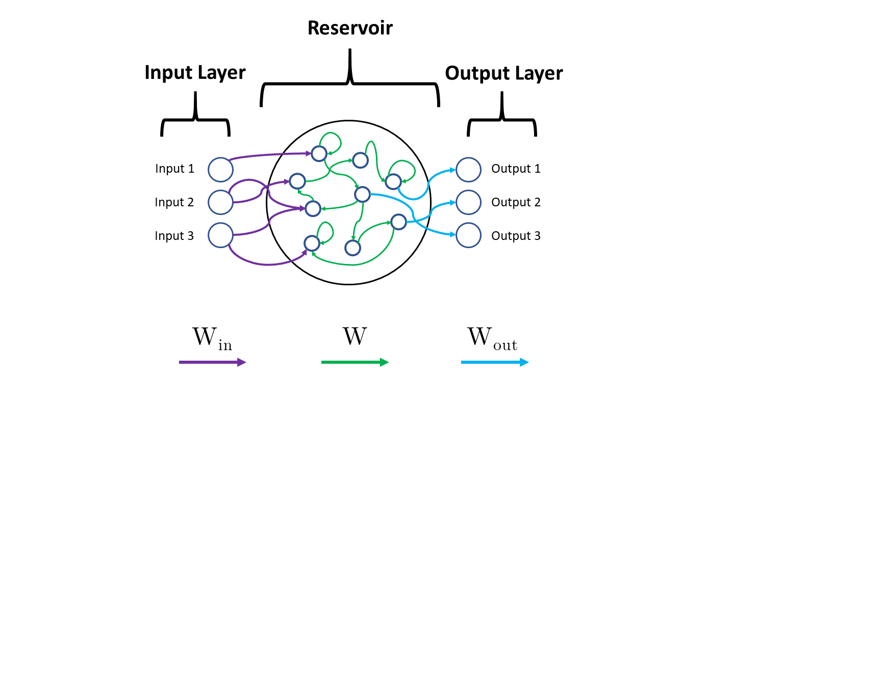
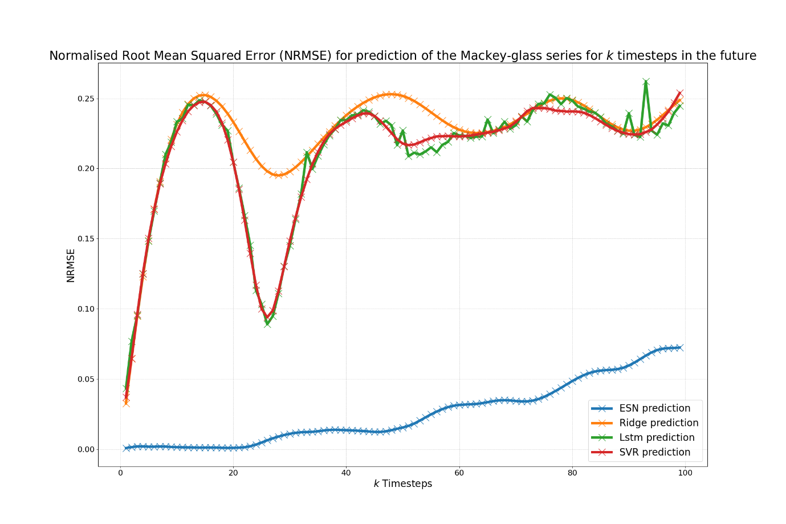
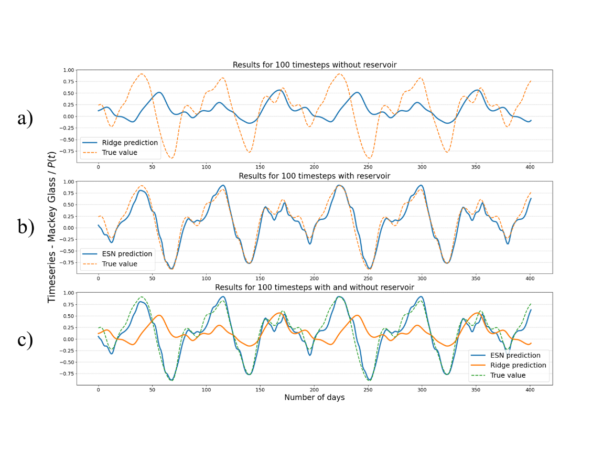
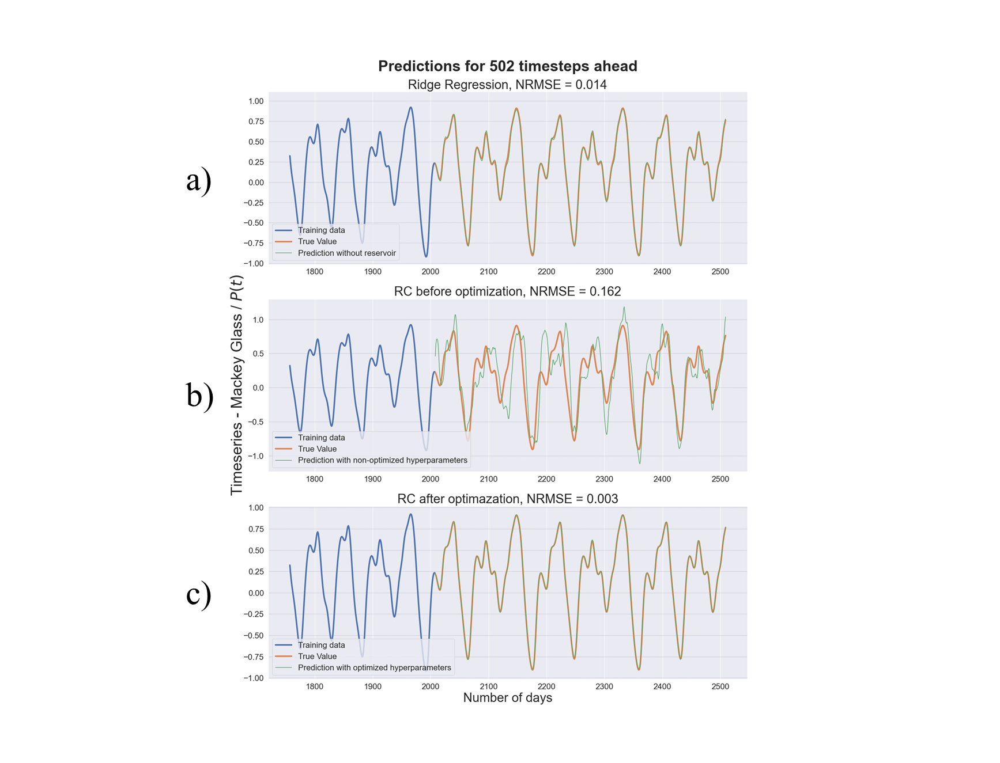
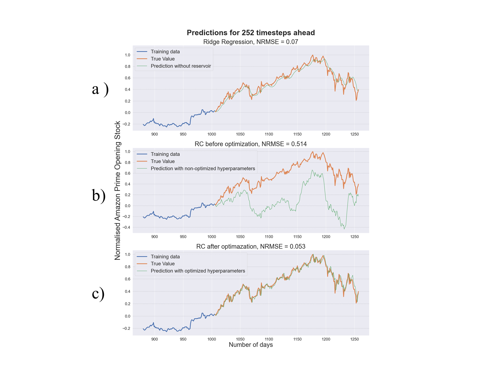

# Reservoir Computing for Time-Series Prediction

My 3rd-year project at UCL (Electronic & Electrical Engineering, 2023), supervised by Hidekazu Kurebayashi.

I used an Echo State Network (ESN), a type of reservoir computer, to predict two time series:

- the Mackey-Glass equation (a standard chaotic benchmark)
- Amazon's daily opening stock price, 2014–2019

I compared it against ridge regression with no reservoir, an LSTM and an SVR, then tuned the ESN's hyperparameters with a random search.

## How an ESN works

<p align="center"></p>

The input goes into a "reservoir": a big set of randomly connected neurons. The connections are random and never trained. The reservoir keeps a fading memory of past inputs, and only the output layer (`W_out`) is trained, with plain ridge regression. Because of that, training is just one linear solve, with no backpropagation.

## Results

NRMSE on the test set (lower is better):

| Task | Ridge (no reservoir) | ESN |
|---|---|---|
| Mackey-Glass, 10 steps ahead | 0.2316 | 0.0014 |
| Mackey-Glass, 100 steps ahead | 0.2519 | 0.0660 |
| Mackey-Glass, sliding window (tuned ESN) | 0.014 | 0.003 |
| Amazon, sliding window (tuned ESN) | 0.070 | 0.053 |

The ESN also beat the LSTM and SVR at every horizon from 1 to 99 steps:

<p align="center"></p>

100 steps ahead, (a) without and (b) with the reservoir:

<p align="center"></p>

Before tuning, the ESN was actually worse than plain ridge regression on the sliding-window tasks. The hyperparameters made a big difference.

<p align="center">
  
  
</p>

More detail is in my report. The main points about what makes a good reservoir are:

- The spectral radius needs to be below 1 so the reservoir stays stable.
- There's a trade-off between memory and non-linearity. Both tuned models ended up with very small input scaling.

## Limitations

<!-- TODO: rewrite this section in my own words -->

- I tuned the hyperparameters on the test set, because I didn't have a separate validation set. So the tuned scores are optimistic.
- The sliding-window predictions are one step ahead, using the real past values each time, not the model's own predictions.
- I didn't reset or warm up the reservoir between runs. The 100-step result (0.0660) depends on that. A fresh ESN gets 0.0731.
- The LSTM and SVR were only tuned by hand, while the ESN got a full search.

## Running it

```bash
git clone https://github.com/SanPixelT/reservoir-computing-time-series.git
cd reservoir-computing-time-series
pip install -r requirements.txt
pip install tensorflow   # optional, only needed for the LSTM

python src/mackey_glass_multistep.py         # experiment 1
python src/mackey_glass_sliding_window.py    # experiment 2 (~7 min)
python src/amazon_stock.py                   # experiment 3, needs the data (see data/README.md)
```

Add `--quick` to any of them for a fast test run. Plots get saved to `results/`.

`original/` has my original 2023 script exactly as it was in my report. `src/` is the same code, tidied up and split into separate files.

## Credits

- [ReservoirPy](https://github.com/reservoirpy/reservoirpy) (MIT License) for the ESN implementation. Some of my code is adapted from their tutorials:
  - **Tutorial 3:** the Mackey-Glass setup and plot, the default ESN settings and some plotting functions.
  - **Tutorial 4:** the hyperparameter search setup.

  These parts are marked in `src/common.py`.
- Amazon data from [Kaggle](https://www.kaggle.com/datasets/prasoonkottarathil/amazon-stock-price-20142019) (P. Kottarathil).

MIT License. Muhammad Alief bin Azman.
